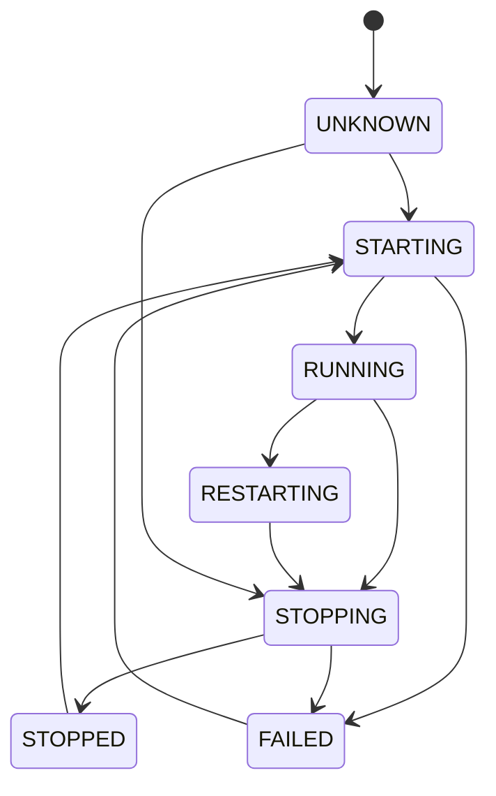

# Architecture — robotsix-central-deploy

## High-level overview

`robotsix-central-deploy` is a **FastAPI** lifecycle server that manages
Docker containers for the robotsix fleet. It acts as a single control plane
to start, stop, restart, deploy, rollback, and inspect every managed
component. It also provides a **reverse-proxy gateway** so each component
is reachable at a well-known URL, an **onboarding pipeline** for adding
new services from docker-compose repos, a **settings API** for operator
runtime configuration, a **background registry checker** that polls GHCR
for newer image versions, and a **volume audit subsystem** that tracks
Docker volume growth over time.

### System component diagram

```
                          ┌─────────────────────────┐
                          │     External clients     │
                          └────────────┬────────────┘
                                       │ HTTP / WS
                                       ▼
┌──────────────────────────────────────────────────────────────────┐
│                     FastAPI Application                           │
│                                                                   │
│  ┌──────────┐  ┌──────────┐  ┌──────────┐  ┌──────────────────┐ │
│  │  /health  │  │  /disk   │  │  /ui     │  │  Gateway Router  │ │
│  │  (open)   │  │  (auth)  │  │  (auth)  │  │  (registered     │ │
│  │           │  │          │  │          │  │   LAST)          │ │
│  └──────────┘  └──────────┘  └──────────┘  └────────┬─────────┘ │
│                                                      │           │
│  ┌──────────────────────────────────────────────────────┐        │
│  │              Lifecycle Router                        │        │
│  │  /services, /services/{name}/{start,stop,restart,    │        │
│  │   deploy,rollback,logs,health,config,env}            │        │
│  └──────────┬───────────────────────────────────────────┘        │
│             │                                                     │
│  ┌──────────┴──────────┐  ┌─────────────────┐                    │
│  │  Onboard Router     │  │  Settings Router │                    │
│  │  /onboard/preflight  │  │  /settings      │                    │
│  │  /onboard/confirm   │  │                 │                    │
│  └──────────┬──────────┘  └─────────────────┘                    │
└─────────────┼────────────────────────────────────────────────────┘
              │
     ┌────────┴────────┬──────────────────┬──────────────────┐
     ▼                 ▼                  ▼                  ▼
┌─────────┐   ┌──────────────┐   ┌──────────────┐   ┌──────────────┐
│ Docker   │   │  Registry    │   │  Registry    │   │  Volume      │
│ Backend  │   │  Checker     │   │  Stores      │   │  Audit       │
│ (SDK or  │   │  (background │   │  (config,    │   │  Scheduler   │
│  CLI)    │   │   polling)   │   │   env,       │   │  (background │
│          │   │              │   │   settings)  │   │   loop)      │
└────┬─────┘   └──────┬───────┘   └──────┬───────┘   └──────┬───────┘
     │                │                  │                   │
     ▼                ▼                  ▼                   ▼
┌─────────┐   ┌──────────────┐   ┌──────────────┐   ┌──────────────┐
│ Docker   │   │  GHCR /      │   │  JSON files  │   │  audit.json  │
│ daemon   │   │  registries  │   │  on disk     │   │  on disk     │
└─────────┘   └──────────────┘   └──────────────┘   └──────────────┘
```

## Subpackage responsibilities

### `lifecycle/` — Lifecycle control API

| File | Role |
|------|------|
| `app.py` | FastAPI application factory. Wires routers, middleware, background tasks. |
| `models.py` | **Service state machine** — `ServiceState` enum, `TRANSITIONS` dict, `can_transition()`, plus all API Pydantic schemas (`ServiceStatus`, `ServiceListItem`, `DeployResponse`, …). |
| `backend.py` | **Execution backends** — `DockerSdkBackend` (default, full-featured), `DockerBackend` (CLI subprocess, limited), `NoopBackend` (testing). Each implements the same abstract interface (`start`, `stop`, `restart`, `deploy`, `rollback`, `status`). |
| `store.py` | **Service store** — `InMemoryStore` and `FileStore` backends that persist `ServiceRecord` state. Selected via `STORE_BACKEND` config. |
| `auth.py` | Authentication — API key + HTTP Basic Auth via FastAPI dependencies. |
| `disk.py` | Host disk usage + `docker system df` breakdown (`GET /disk`). |

**Public API surface**: `GET /services`, `GET /services/{name}`, `GET /services/{name}/health`, `GET /services/{name}/logs`, `POST /services/{name}/start`, `POST /services/{name}/stop`, `POST /services/{name}/restart`, `POST /services/{name}/deploy`, `POST /services/{name}/rollback`, `DELETE /services/{name}`, `GET /services/{name}/config`, `PUT /services/{name}/config`, `GET /services/{name}/env`, `PUT /services/{name}/env`, `DELETE /services/{name}/env/{key}`.

### `gateway/` — Reverse proxy

| File | Role |
|------|------|
| `proxy.py` | Low-level HTTP and WebSocket relay. Strips hop-by-hop headers, adds `X-Forwarded-*`, handles SSE streaming, rewrites `Location` headers on redirects. |
| `router.py` | FastAPI route definitions — **must be registered last** on the app so built-in API routes match first. Implements subdomain routing and path-prefix routing. |

### `onboard/` — Git-clone ingestion

| File | Role |
|------|------|
| `fetcher.py` | `fetch_repo_files(git_url)` — shallow-clones a service repo, reads `deploy/docker-compose.yml` and optionally `config/config.yaml`. |
| `parser.py` | `parse_compose(compose_bytes, name, git_url)` — validates the compose file against the deploy contract, extracts service definitions, returns a `DerivedSpec`. |
| `models.py` | Pydantic models: `RepoFiles`, `DerivedSpec`, parse-error types. |

### `registry/` — Persistence stores

| File | Store class | Purpose |
|------|-------------|---------|
| `models.py` | *(data types)* | `ComponentConfig`, `ServiceConfig`, `PortMapping`, `VolumeMount`, `HealthCheck` — Pydantic models defining the shape of a deployed component. |
| `loader.py` | `ComponentRegistry` | Reads **static** YAML manifest (`registry.yaml`) into an in-memory index. Backs the gateway's component name resolution. |
| `config_store.py` | `ComponentConfigStore` | JSON store for **dynamically onboarded** components. Async-locked, atomic write (tmp + rename). |
| `env_store.py` | `EnvStore` | JSON store for per-component environment variables and Fernet-encrypted secrets. |
| `config_yaml_store.py` | `ConfigYamlStore` | JSON store for per-component `config.yaml` templates and user-saved values. |
| `settings_store.py` | `SystemSettingsStore` | JSON store for system-wide operator settings (auth, disk warn %, registry check interval, log level, gateway base domain). |
| `secret_key.py` | `SecretKeyManager` | Fernet encryption/decryption wrapper. **Key loss is irrecoverable** — secrets must be re-entered if `secrets.key` is deleted. |

### `registry_check/` — Background registry polling

| File | Role |
|------|------|
| `checker.py` | `RegistryChecker` — fetches OCI/Docker manifest digests from GHCR, caches results with a configurable TTL. Returns `None` for unsupported registries. |

### `volume_audit/` — Volume growth detection

| File | Role |
|------|------|
| `models.py` | Pydantic schemas: `VolumeSizeSnapshot`, `VolumeGrowthRecord`, `AuditFinding`, `VolumeAuditResponse`. |
| `growth.py` | `compute_growth_records()` — compares two snapshots; flags a finding when both absolute and percentage thresholds are breached. |
| `reporter.py` | `report_finding()` — logs at WARNING, appends to a local JSON file, optionally creates a board ticket. |
| `scheduler.py` | `VolumeAuditScheduler` — orchestrator. `run_once()` measures every volume, computes deltas, reports findings, persists the new snapshot. `loop()` runs this periodically as a background asyncio Task. |

### `ui/` — Dashboard

| File | Role |
|------|------|
| `router.py` | Serves `dashboard.html` at `/ui` and `login.html` at `/login`. |
| `dashboard.html` | Single-page HTML dashboard with service status, logs, and action buttons. |
| `login.html` | Login page for session-based auth. |

## Data flow

### git clone → parse → deploy → monitor → volume audit

```
1.  User runs POST /onboard/preflight {git_url}
      │
      ▼
2.  onboard/fetcher.py
      git clone --depth 1 $git_url
      read deploy/docker-compose.yml
      read config/config.yaml (or fallback template)
      → RepoFiles
      │
      ▼
3.  onboard/parser.py
      validate contract header
      parse compose → extract services, ports, volumes, healthchecks
      validate labels, named volumes, no bind-mounts / build:
      → DerivedSpec
      │
      ▼
4.  POST /onboard/confirm {DerivedSpec}
      persist ComponentConfig → ComponentConfigStore
      optionally save config.yaml template → ConfigYamlStore
      │
      ▼
5.  DockerSdkBackend.deploy()
      pull image, create container, start
      persist ServiceRecord → ServiceStore
      │
      ▼
6.  Gateway resolves component name at runtime
      .deploy.robotsix.net subdomain → container_name
      or path-prefix /component-name/...
      │
      ▼
7.  Background tasks:
      RegistryChecker polls GHCR for newer digests
        → sets update_available on ServiceRecord
      VolumeAuditScheduler measures volume sizes
        → reports growth findings
```

## Service state machine

### ServiceState transitions

```
                    ┌──────────┐
                    │  STOPPED │
                    └────┬─────┘
                         │ start
                         ▼
       ┌────────────────────────────┐
       │         STARTING           │
       └──────┬───────────┬─────────┘
              │ success    │ failure
              ▼            ▼
      ┌──────────┐   ┌──────────┐
      │ RUNNING  │   │  FAILED  │
      └──┬───┬───┘   └────┬─────┘
   stop  │   │ restart     │ start
         ▼   ▼             │
   ┌──────────┐            │
   │ STOPPING │◄───────────┘
   └────┬─────┘      ┌──────────────┐
        │            │  RESTARTING  │
   ┌────┴─────┐      └──────┬───────┘
   │ success  │ failure     │ (always
   ▼          ▼             │  proceeds)
┌──────┐  ┌──────┐          ▼
│STOPPED│ │FAILED│    ┌──────────┐
└──────┘  └──────┘    │ STOPPING │
                      └──────────┘

UNKNOWN ──► STARTING | STOPPING
```

States at rest (`RESTING_STATES`): `STOPPED`, `RUNNING`, `FAILED`, `UNKNOWN`.

All mutating endpoints are **idempotent**: if the service is already in
the requested state (or mid-transition toward it), the endpoint returns
success without action. Invalid transitions return **409 Conflict**.

### Mermaid diagram



## Gateway routing rules

The gateway router is **registered last** on the FastAPI app so
built-in endpoints (`/health`, `/ui`, `/services`, `/onboard`, …)
match first. Two routing modes exist:

### 1. Subdomain routing (primary)

When the `Host` header ends with the configured gateway base domain
(default: `.deploy.robotsix.net`), the subdomain is extracted as the
component name:

- `mail.deploy.robotsix.net` → component `"mail"`
- `auth.deploy.robotsix.net/some/path` → component `"auth"`, path `/some/path`

This mode is only active for HTTP (not WebSocket) at the root `"/"` route.

### 2. Path-prefix routing (legacy fallback)

When no subdomain matches, the first path segment is the component name:

- `deploy.robotsix.net/mail/` → component `"mail"`
- `deploy.robotsix.net/auth/api/v1` → component `"auth"`, path `/api/v1`

This mode handles both HTTP and WebSocket via the catch-all `"/{path:path}"` route.

### Reserved names

These names shadow central-deploy's own endpoints and are **never**
resolved as component slugs: `ui`, `health`, `services`, `onboard`,
`docs`, `openapi.json`, `redoc`, `disk`, `settings`, `help`, `volumes`,
`login`, `logout`.

### Resolution

`_resolve(name)` looks up `app.state.registry` (a `ComponentRegistry`),
which indexes both statically-configured and dynamically-onboarded
components. The `container_name` and first port from the component's
`ComponentConfig` are used to build the upstream URL
(`http://<container_name>:<port>`).

### Proxy behaviour

- **HTTP**: strips hop-by-hop headers (`Connection`, `Keep-Alive`,
  `Transfer-Encoding`, `Host`, …), adds `X-Forwarded-*` headers,
  streams the response chunk-by-chunk. SSE (`text/event-stream`) is
  passed through transparently. Redirect `Location` headers are
  rewritten to preserve the path prefix.
- **WebSocket**: bidirectional relay via two asyncio Tasks
  (`client→backend`, `backend→client`), cancelled when either side
  disconnects.

## Key design decisions

### Why async vs sync stores

All registry stores (`ComponentConfigStore`, `EnvStore`,
`ConfigYamlStore`, `SystemSettingsStore`) are async with
`asyncio.Lock` serialisation. This is **not** because JSON
file I/O benefits from async — `json.loads()` and `Path.read_text()`
are synchronous. The async pattern exists to:

1. **Coexist with the FastAPI event loop** — all store calls happen
   inside async request handlers and background tasks. A synchronous
   file read that blocks the event loop would stall concurrent requests.
2. **Provide serialised access** — `asyncio.Lock` prevents concurrent
   read-modify-write races without needing filesystem-level locking.
3. **Consistency** — every store follows the same `async def get/put/delete`
   interface, making them interchangeable and testable.

### Deploy contract philosophy

The deploy contract (`docs/DEPLOY_CONTRACT.md`) enforces a strict
separation between **development** and **deployment**:

- The repo-root `docker-compose.yml` is for **local development** and
  is **ignored** by the onboarding pipeline.
- The `deploy/docker-compose.yml` is the **production contract** that
  the central-deploy server reads. It must start with
  `# central-deploy-contract-version: 1`.
- Bind-mounts are **prohibited** — only named volumes are allowed
  (with one exception: `claude-mount`, which mounts `~/.claude` and
  requires an explicit label).
- `build:` is **prohibited** — only pre-built images are allowed.

This split prevents config drift between dev and prod and ensures the
central-deploy server can reason about every container's volumes,
ports, and health checks without ambiguity.

### Multi-service components (siblings)

Components with multiple services are modelled as one primary plus
N siblings. Sibling services are identified with
`robotsix.deploy.primary: "true"` on the primary (exactly one required
when N>1). Lifecycle actions (start/stop/restart/deploy/rollback/delete)
**fan out** to siblings on a best-effort basis — a sibling failure is
logged but does not fail the primary operation.

### Execution backend abstraction

Three backends exist, selected by `EXECUTION_BACKEND`:

| Backend | When to use |
|---------|-------------|
| `docker_sdk` (default) | Production. Full-featured: pull, create, start, stop, logs, health, deploy, rollback. |
| `docker` | Legacy/fallback. Uses `docker` CLI via subprocess. Deploy/rollback raise `NotImplementedError`. |
| `noop` | Testing. All operations succeed silently. Always reports `sha256:noop` digest. |

### Fernet-based secret storage

Component environment secrets are encrypted at rest using Fernet
(symmetric encryption). The Fernet key is stored on disk at a
configured path. **Key loss is irrecoverable** — if the key file is
deleted, all stored secrets become unreadable and must be re-entered
by an operator.

### Background tasks

Two background `asyncio.Task` loops run in the same process:

1. **Registry checker** — polls GHCR for each component's image digest
   at `REGISTRY_CHECK_INTERVAL` (default 300s). Sets `update_available`
   on `ServiceRecord` so the dashboard can surface stale images.

2. **Volume audit** — measures every volume's size, compares against
   the previous snapshot, and reports findings when both absolute and
   percentage growth thresholds are breached. Findings are logged,
   persisted to disk, and optionally filed as board tickets.

Both are started during app startup and run for the lifetime of the
process.
